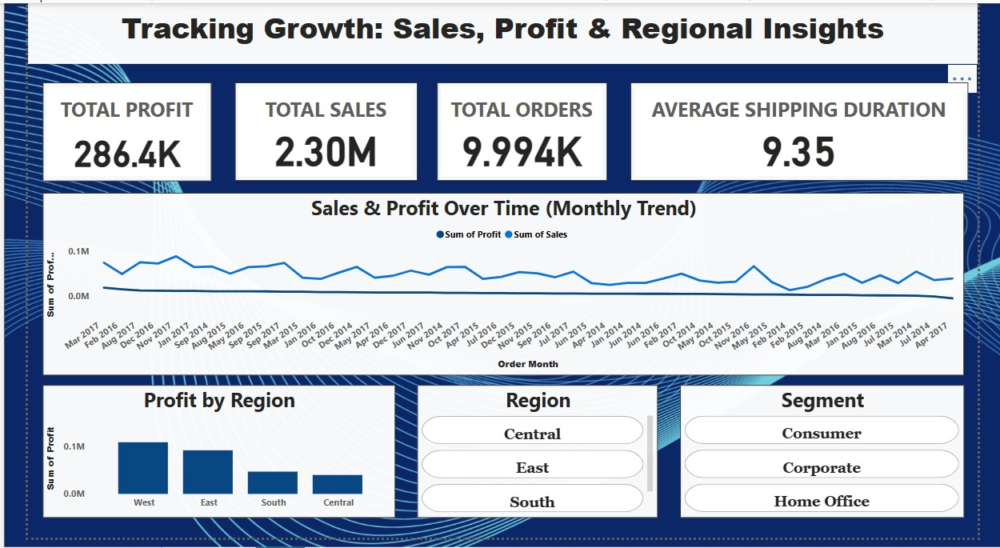
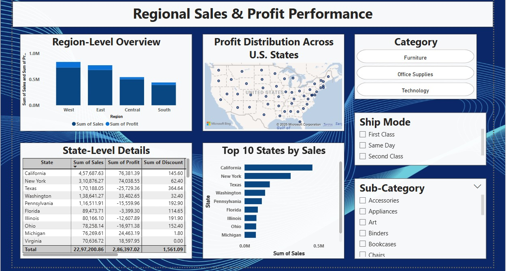
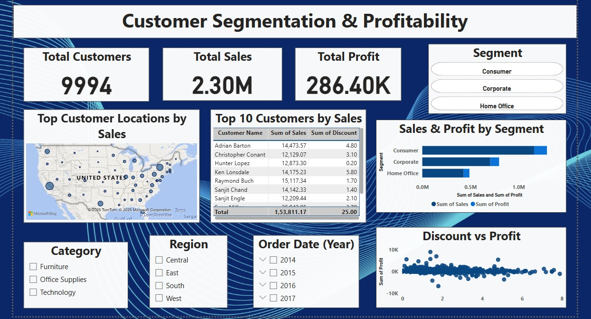

# superstore-powerbi-dashboard

This Power BI dashboard provides a deep analysis of the Superstore dataset, highlighting product performance, regional trends, customer segmentation, and profitability.

**Tools Used**
- Power BI
- Excel (for data cleaning)
- DAX (Data Analysis Expressions)

**Key Insights**
- Technology is the most profitable category.
- The West region performs best in both sales and profit.
- High discounts lead to reduced profits, especially in the Furniture category.
- Consumer segment contributes the most to total sales and profit.

**Dashboard Snapshots**
### Page 1: Executive Overview

### Page 2: Product Analysis

### Page 3: Regional Performance

### Page 4: Customer Segmentation

**File Info**
- 'superstore-analysis.pbix': Power BI dashboard file.
- '*.jpg': Dashboard page screenshots.
- 'SampleSuperstore.csv': Dataset used for the analysis. ( https://www.kaggle.com/datasets/vivek468/superstore-dataset-final)

**Conclusion**
> Discounting strategies and unprofitable segments need close attention to boost margins. Focus on top-performing categories and regions for growth.

**To open the report**: Download the '.pbix' file and open it using Power BI Desktop.
